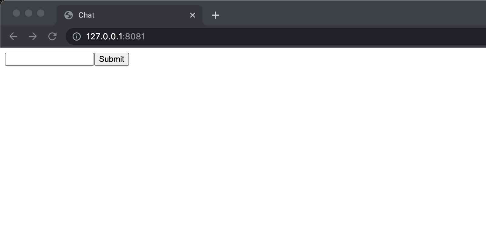

# Frontend

## Create Git Repository

```bash
git init
git branch -m main
mkdir fe
```

## Create `public/app.js`

This file will contain all of our application logic.  There are many ways to utilize HTML, JS, and CSS to build web applications. The approach taken below focuses on creating all html elements and adding styles directly from JavaScript code.  

```js
// public/app.js
const root = document.getElementById("root");

const form = document.createElement("form");
const input = document.createElement("input");

const button = document.createElement("button");
button.innerText = "Submit";

const messageList = document.createElement("div");

/*
  This creates a final DOM structure that looks like:

  <body id="root">
    <form>
      <input />
      <button />
    </form>
    <div></div>
  </body>
*/
form.append(input);
form.append(button);

root.append(form);
root.append(messageList);

form.addEventListener("submit", handleSubmit);

function handleSubmit(e) {
  e.preventDefault();

  messageList.append(Message(input.value));

  input.value = "";
}

function Message(body) {
  const el = document.createElement("div");

  el.innerText = body;

  return el;
}
```

## Create `public/index.html`

> In VS Code simply typing `doc` in an open `.html` file will prompt a snippet that automatically provides the basic html structure below

```html
<!-- public/index.html -->
<html lang="en">
<head>
  <meta charset="UTF-8">
  <meta http-equiv="X-UA-Compatible" content="IE=edge">
  <meta name="viewport" content="width=device-width, initial-scale=1.0">
  <title>Chat</title>
  <!-- This tells the browser to load app.js -->
  <!-- The async and defer attributes ensure this is done after the page has loaded -->
  <script src="/app.js" async defer></script>
</head>
<!-- This is the element that our app.js file gets and is the top level node for our application -->
<body id="root">

</body>
</html>
```

## Commit Changes

```bash
git add -A
git commit -m "Initial Commit"
```

## Test the Frontend

### Install http-server

There are many ways to serve your static files.  A simple tool I use when experimenting is the `http-server` npm package.

`npm i -g http-server`

You can then serve your application with:

`http-server public`

It should then be accessible via [http://localhost:8080](http://localhost:8080).

### Expected Output



You should be able to type a message in the input box and press enter or click the submit button to "submit" the message.  For now, the message gets added to the page below the input.  If you refresh the page any messages you created will no longer exist. The next tutorial will go over how to persist these messages using a backend.